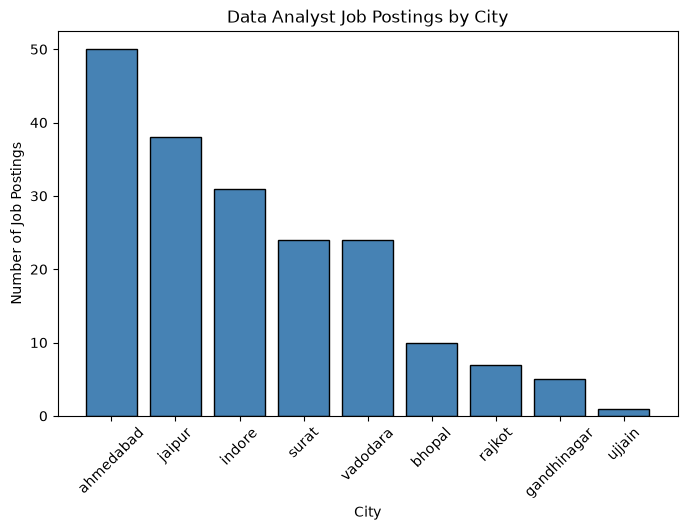
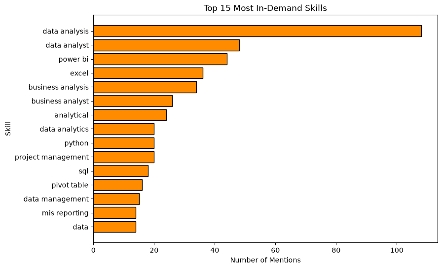
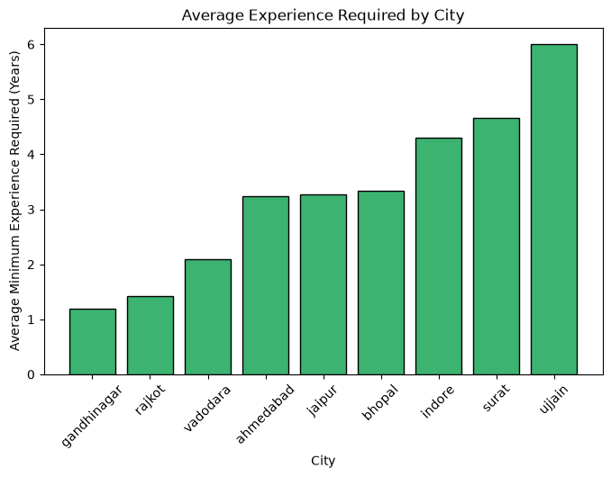
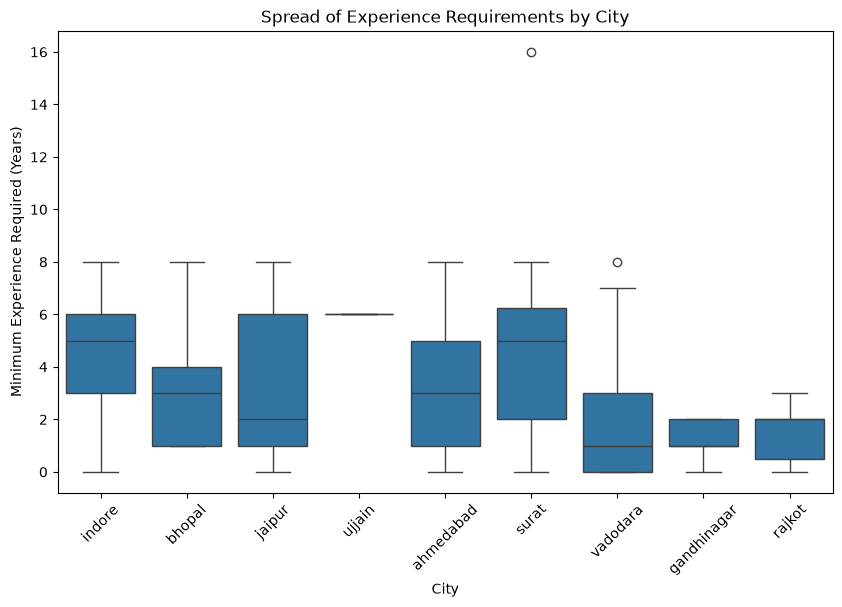
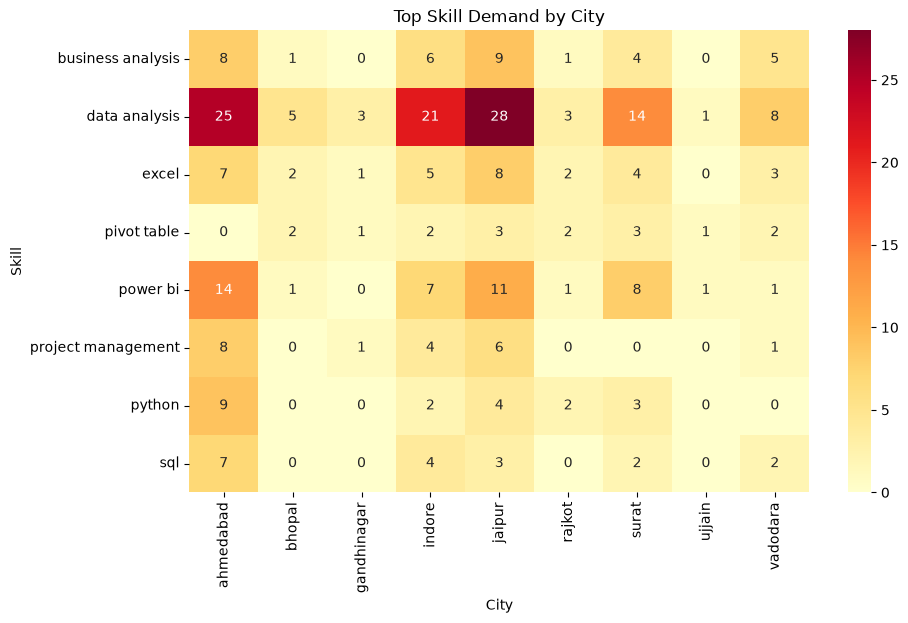

# Data Analyst Job Market Study — Tier-2 Cities (MP & Gujarat)

Most job market analyses focus on Bangalore, Mumbai, or Delhi. I wanted to know what the Data Analyst job market actually looks like in the cities I'm applying in — smaller cities that usually get skipped.

   

---

## 📖 Project Overview

This project scrapes live Data Analyst / Business Analyst / MIS job postings from Naukri.com across 9 cities in Madhya Pradesh and Gujarat (Indore, Bhopal, Ujjain, Ahmedabad, Surat, Vadodara, Gandhinagar, Rajkot, Jaipur), then analyzes where demand is concentrated and what skills actually show up most in these postings — instead of assuming metro-city trends apply everywhere.

**Final dataset: 190 relevant postings**, after cleaning and filtering out unrelated roles that Naukri's search loosely includes (e.g. Data Scientist, Sales roles).

---

## 🛠️ Data Collection & Methodology

Scraping Naukri turned out to be the hardest part of this project — the site actively blocks automated access. I worked through this step-by-step with Claude (Anthropic's AI assistant) to debug each blocker as it came up, and ended up learning a lot about how bot detection actually works along the way.

Here's what happened, in order:

1. **Plain `requests` + `BeautifulSoup`:** Didn't work — Naukri loads job listings using JavaScript after the page loads, so the raw HTML `requests` receives is empty.
2. **Naukri's internal JSON API directly:** Found this via the browser's Network tab — much cleaner than scraping HTML. But calling it directly returned a `406` error every time, because it's protected by **Akamai Bot Manager** (an anti-bot service many large sites use).
3. **Selenium (a tool that controls a real browser):** Even in headless mode, Akamai detected it as automated and served an "Access Denied" page.
4. **What finally worked: `undetected-chromedriver` + `pyvirtualdisplay`.** This runs an actual, full (non-headless) Chrome browser inside a virtual display — meaning it behaves like a real person's browser instead of a script, which is what got past Akamai's detection.

In plain terms: **`undetected-chromedriver`** is a patched version of Selenium's browser driver that hides the usual signs of automation. **`pyvirtualdisplay`** lets that real browser run on a server (like Google Colab) without needing an actual physical screen. Together, they let the scraper behave close enough to a real user that Naukri served real data instead of a block page.

Once the scraper worked, ~300 postings were collected across the 9 cities, then filtered down to the 190 relevant to Data Analyst / Business Analyst / MIS roles.

---

## 🧹 Data Cleaning

- Filled missing `experience` and `skills` values with `"Not Specified"` — did this only after splitting experience into numbers, so blanks didn't get mistaken for real values.
- Split `experience` (e.g. `"3-6 Yrs"`) into numeric `min_experience` / `max_experience` columns. Left genuinely unknown experience as blank rather than 0, since 0 would incorrectly suggest "no experience needed."
- Standardized `skills`: lowercased everything, stripped extra spaces, and merged near-duplicate tags (e.g. `"Advanced Excel"` → `"excel"`) so the same skill wasn't being counted as two different things.

---

## 📊 Key Questions Answered

**Q1: Where are Data Analyst-type jobs actually concentrated in this region?**

Ahmedabad, Jaipur, and Indore account for most postings. Ujjain had just 1 relevant listing in the entire scrape — a clear sign of how thin the market is outside the bigger cities.

**Q2: What skills do these postings actually ask for?**

`data analysis` shows up in 108 of 190 postings — by far the most requested. Power BI and Excel follow, ahead of programming skills like Python and SQL.

**Q3: Does experience required vary by city, and is the average number reliable?**

Gandhinagar and Rajkot skew junior. Surat's *average* experience looked similar to Indore's, but the boxplot shows Surat has a single outlier posting asking for 16 years — the average alone would have hidden that.

**Q4: Is skill demand the same across every city?**

Jaipur actually has the highest raw count of `data analysis`-tagged postings (28) — more than Ahmedabad, despite Ahmedabad having more total postings overall (50). Ahmedabad's demand is spread wider across Python, SQL, and project management, suggesting a broader market rather than a deeper one for this specific skill.

---

## 🗃️ Data Dictionary

| Column Name | Description | Data Type |
|---|---|---|
| `job_title` | Job title as listed on Naukri | String |
| `company` | Hiring company name | String |
| `location` | Location text shown on the posting | String |
| `experience` | Original experience text (e.g. "3-6 Yrs") | String |
| `min_experience` / `max_experience` | Experience range split into numbers | Int64 |
| `salary` | Salary if disclosed, else "Not Disclosed" | String |
| `skills` | Original skill tags as scraped | String |
| `skills_clean` | Lowercased, standardized skill tags | String |
| `city_searched` | City this posting was scraped under | String |

---

## ⚠️ Limitations

- Salary was disclosed in only a small fraction of postings, so it wasn't used for any city-wise comparison.
- Ujjain's stats are based on a single posting and aren't statistically meaningful — included for completeness only.
- This is a single point-in-time snapshot, not a historical trend.

---

## 🚀 How to Run This Project

1. Clone this repo.
2. Install dependencies: `pandas`, `numpy`, `matplotlib`, `seaborn` (for analysis), plus `undetected-chromedriver` and `pyvirtualdisplay` (only needed if re-running the scraper).
3. Open `notebooks/naukri_project.ipynb` in Jupyter.
4. Run the first cell to clean the data in `data/raw/`, then run the remaining cells to reproduce all charts.

---

## Author
Himesh Bamboriya — [GitHub](https://github.com/himeshbamboriya)
